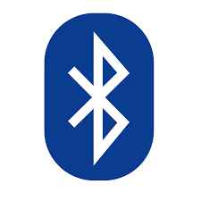

# BLUETOOTH

# Pengertian Bluetooth
  Bluetooth adalah spesifikasi industri untuk jaringan kawasan pribadi (personal area networks atau PAN) tanpa kabel. Bluetooth menghubungkan dan dapat dipakai untuk melakukan tukar-menukar informasi di antara peralatan-peralatan. Spesifiksi dari peralatan Bluetooth ini dikembangkan dan didistribusikan oleh kelompok Bluetooth Special Interest Group.

Bluetooth beroperasi dalam pita frekuensi 2,4 GHz dengan menggunakan sebuah frequency hopping traceiver yang mampu menyediakan layanan komunikasi data dan suara secara real time antara host-host bluetooth dengan jarak terbatas. Kelemahan teknologi ini adalah jangkauannya yang pendek dan kemampuan transfer data yang rendah.

# Sejarah Bluetooth
  Awal mula dari Bluetooth adalah sebagai teknologi komunikasi wireless (tanpa kabel) yang beroperasi dalam pita frekuensi 2,4 GHz unlicensed ISM (Industrial, Scientific and Medical) dengan menggunakan sebuah frequency hopping tranceiver yang mampu menyediakan layanan komunikasi data dan suara secara real-time antara host-host bluetooth dengan jarak jangkauan layanan yang terbatas yakni sekitar 10 meter. Bluetooth berupa kartu yang menggunakan frekuensi radio standar IEEE 802.11 dengan jarak layanan yang terbatas dan kemampuan data transfer lebih rendah dari kartu untuk Wireless Local Area Network (WLAN).

Pembentukan Bluetooth dipromotori oleh 5 perusahaan besar Ericsson, IBM, Intel, Nokia dan Toshiba membentuk sebuah Special Interest Group (SIG) yang meluncurkan proyek ini. Pada bulan Juli 1999 dokumen spesifikasi bluetooth versi 1.0 mulai diluncurkan. Pada bulan Desember 1999 dimulai lagi pembuatan dokumen spesifikasi bluetooth versi 2.0 dengan tambahan 4 promotor baru yaitu 3Com, Lucent Technologies, Microsoft dan Motorola. Saat ini, lebih dari 1800 perusahaan di berbagai bidang bergabung dalam sebuah konsorsium sebagai adopter teknologi bluetooth. Walaupun standar Bluetooth SIG saat ini ‘dimiliki’ oleh grup promotor tetapi ia diharapkan akan menjadi sebuah standar IEEE (802.15)

# Asal Nama Bluetooth
  Nama "bluetooth" berasal dari nama raja di akhir abad sepuluh, Harald Blatand (Abad 10) yang di Inggris juga dijuluki Harald Bluetooth kemungkinan karena memang giginya berwarna gelap. Ia adalah raja Denmark yang telah berhasil menyatukan suku-suku yang sebelumnya berperang, termasuk suku dari wilayah yang sekarang bernama Norwegia dan Swedia. Bahkan wilayah Scania di Swedia, tempat teknologi bluetooth ini ditemukan juga termasuk daerah kekuasaannya. Kemampuan raja itu sebagai pemersatu juga mirip dengan teknologi bluetooth sekarang yang bisa menghubungkan berbagai peralatan seperti komputer personal dan telepon genggam.[2]

Sedangkan logo bluetooth berasal dari penyatuan dua huruf Jerman yang analog dengan huruf H dan B (singkatan dari Harald Bluetooth), yaitu H-rune.gif (Hagall) dan Runic letter berkanan.png (Blatand) yang kemudian digabungkan.

# Fitur Keamanan
  Bluetooth dirancang untuk memiliki fitur-fitur keamanan sehingga dapat digunakan secara aman baik dalam lingkungan bisnis maupun rumah tangga. Fitur-fitur yang disediakan bluetooth antara lain sebagai berikut:

    Enkripsi data
    Autentikasi pengguna
    Lompatan frekuensi cepat (1600 hops/sec)
    Kontrol pengeluaran energi
    
Fitur-fitur tersebut menyediakan fungsi-fungsi keamanan dari tingkat keamanan layer fisik/ radio yaitu gangguan dari penyadapan sampai dengan tingkat keamanan layer yang lebih tinggi seperti password dan PIN. Tetapi dari sebuah artikel Internet, menurut penelitian dua mahasiswa Universitas Tel Aviv, mengenai adanya kemungkinan Bluetooth bisa disadap dengan proses pairing berpasangan.

Caranya adalah dengan menyiapkan sebuah kunci rahasia pada proses pairing. Selama ini dua perangkat bluetooth menyiapkan kunci digital 128 bit. Ini adalah kunci rahasia yang kemudian disimpan dan dipakai dalam proses enkripsi pada komunikasi selanjutnya. Langkah pertama ini mengharuskan pengguna yang sah untuk menginputkan kunci rahasia yang sesuai, PIN empat digit ke perangkat. Pesan lalu dikirim ke perangkat lainnya, dan ketika ditanyai kunci rahasia, dia berpura-pura lupa. Hal ini memacu perangkat lain untuk memutus kunci dan keduanya lalu mulai proses pairing baru. Kesempatan ini kemudian bisa dimanfaatkan oleh hacker untuk mengetahui kunci rahasia yang baru. Selain mengirim ini ke perangkat Bluetooth yang dituju, semua perangkat Bluetooth yang ada dalam jangkauan itu juga tetap dapat disadap.

